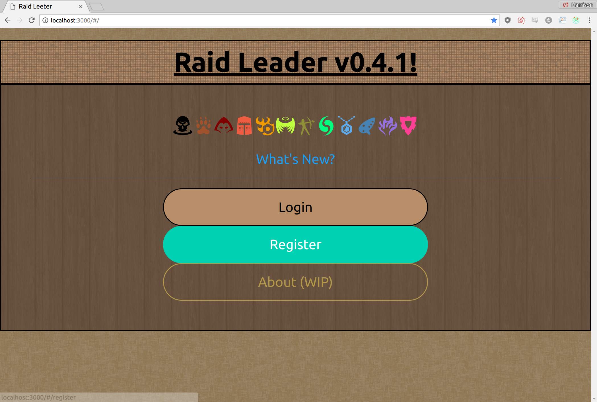
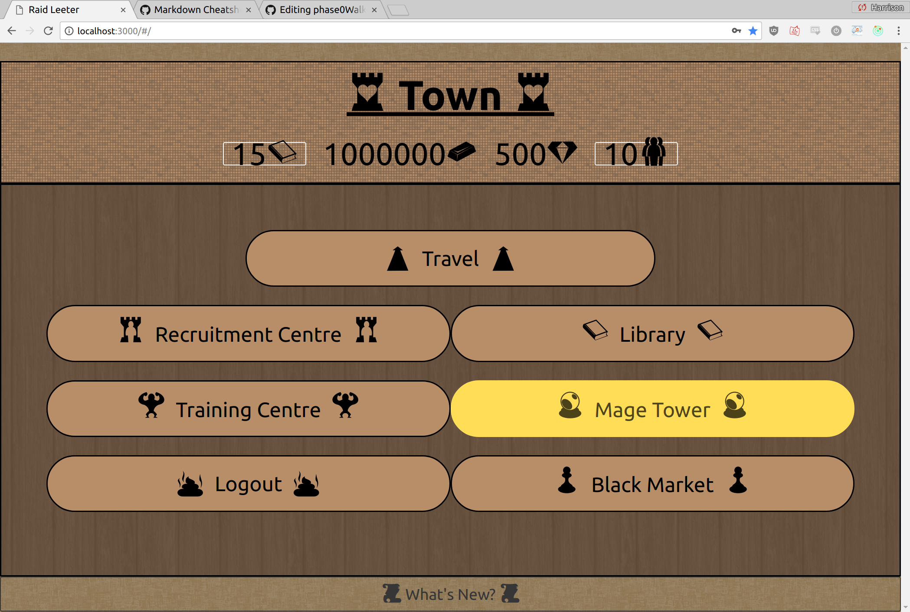
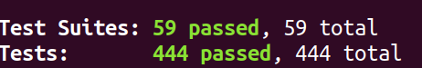
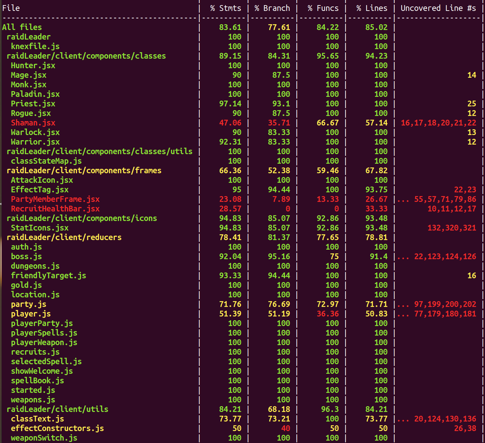
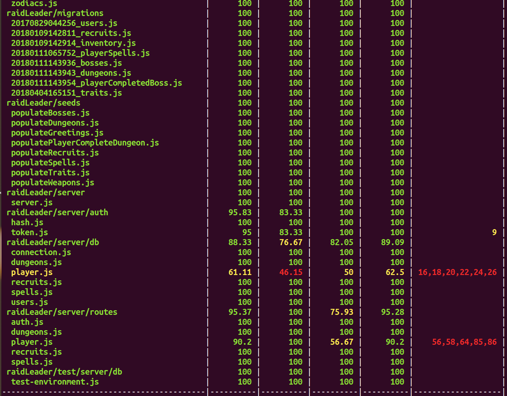

# Welcome to Raid Leader


## Live at https://raidleeter.herokuapp.com

## Current live build: 0.5.0 Alpha

---

## Getting Started

Check out the [Developer Documentation](./developerDocs/README.md) for understanding the behaviour / purpose of utilties and APIs

Check out the [Patch Notes](./developerDocs/patchNotes.md) to read about recent changes to the game!

If you wish to run this repo locally, simply


Clone to repo:
```
git clone https://github.com/harrison-symes/RaidLeader.git
cd RaiderLeader
```

Install the Modules:
```
npm install
  - or -
yarn install
```

Run the App:
```
npm start
 - or -
yarn start
```

(If you wish to run the App in dev mode:)
```
npm run dev
  - or -
yarn dev
```

Then open a browser and go to http://localhost:3000 to see the game.
You should see a *Login* screen like so:




### Set up Database

Run the Migrations:
```
  npm run knex migrate:latest
   - or -
  yarn knex migratelatest
```

Run the seeds (default data, some is for test users, some is important for game data)

```
  npm run knex seed:run
   - or -
  yarn knex seed:run
```

Set up the .env file
(rename `.env-example` to `.env`. This is for JWT token authentication)

```
  mv .env-example .env
```

Everything should be good to go!

Login with the default test user u shto ensure login and server are working:
* Username: Krang
* Password: Krang

You should then see a screen that looks something like:




You may also run my Test-Suite (through Jest) to make sure everything is in order.

```
npm test
 - or -
yarn test
```

The test output should look like this:






**Have Fun!**
---
